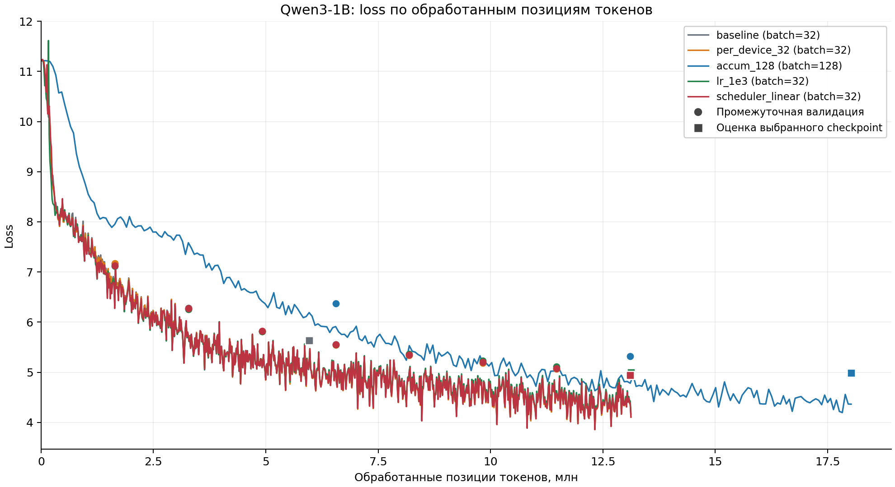

# HW1. Обучение Qwen3-1B на русской Википедии

Модель обучена с нуля на A100. Каждый основной прогон имеет лимит обучения 15 минут.  
Ни один прогон не показал устойчивого соответствия генераций теме промпта. Снижение loss улучшило форму текста. Но оно не обеспечило достоверность содержания.

## 1. Условия эксперимента

### Модель

`Qwen3ForCausalLM._from_config` создаёт модель со случайными весами.
Предобученные веса Qwen не используются.


| Параметр                         | Значение            |
| -------------------------------- | ------------------- |
| Число параметров                 | 960 881 664         |
| `hidden_size` / число слоёв      | 2048 / 12           |
| Число attention heads / KV heads | 16 / 8              |
| `intermediate_size` / `head_dim` | 8192 / 128          |
| Функция активации                | `silu`              |
| Attention                        | `flash_attention_2` |
| Точность                         | `bf16`, `tf32`      |


### Данные

Корпус — `wikimedia/wikipedia`, конфигурация `20231101.ru`, split `train`.
Корпус содержит 1 945 063 статьи.
Первые 5000 статей составляют отложенный набор. Остальные 1 940 063 статьи используются для обучения.
Разделение сохраняет исходный порядок статей.

Токенизатор — `ai-forever/rugpt3small_based_on_gpt2`.
Каждая статья даёт одну последовательность длиной 512 позиций.
Длинные статьи обрезаются. Короткие статьи дополняются padding.
`pad_token` совпадает с `eos_token`. Метки padding имеют значение `-100`, согласно `attention_mask`.
Эти позиции не участвуют в расчёте loss.
Данные сохранены в 32 последовательных Parquet-шардах.

Основные прогоны используют один отложенный набор для выбора checkpoint и финальной оценки.
Отдельного независимого test-набора у этих прогонов нет.
Поэтому финальная оценка остаётся валидационной метрикой.

### Обучение и остановка

Общие настройки: AdamW fused, weight decay 0.01, warmup 50 шагов оптимизатора.
Валидация и сохранение checkpoint выполняются каждые 100 шагов.
`torch_compile` и gradient checkpointing выключены.
Обучение запланировано на одну эпоху. Callback останавливает его по времени.

`TimeoutCallback` проверяет время после шага оптимизатора.
Он не прерывает текущую валидацию или сохранение.
При остановке callback запускает дополнительную валидацию и сохранение.
Затем Trainer загружает checkpoint с наименьшим eval loss.
После `trainer.train()` выполняется отдельная финальная оценка и генерация.
Поэтому полное время работы превышает 900 секунд.

Одна эпоха содержит 60 627 шагов при эффективном батче 32.
При батче 128 она содержит 15 157 шагов.
Основные прогоны проходят только 0.6–1.8% эпохи.

## 2. Конфигурации

Эффективный батч равен микробатчу, умноженному на число шагов накопления градиента.
Здесь используется одна GPU.


| Прогон             | Микробатч | Накопление | Эффективный батч | Learning rate | Scheduler |
| ------------------ | --------- | ---------- | ---------------- | ------------- | --------- |
| `baseline`         | 16        | 2          | 32               | 6e-4          | cosine    |
| `per_device_32`    | 32        | 1          | 32               | 6e-4          | cosine    |
| `accum_128`        | 16        | 8          | 128              | 6e-4          | cosine    |
| `lr_1e3`           | 16        | 2          | 32               | 1e-3          | cosine    |
| `scheduler_linear` | 16        | 2          | 32               | 6e-4          | linear    |


`per_device_32` меняет микробатч и накопление одновременно. Эффективный батч остаётся равным 32.
`accum_128` увеличивает эффективный батч в четыре раза.
`lr_1e3` меняет learning rate. `scheduler_linear` меняет scheduler.

Это сравнение отдельных прогонов при ограниченном времени.
Различия во времени валидации не позволяют считать его полностью контролируемым сравнением скорости.
Повторных прогонов для оценки разброса нет.

## 3. Результаты обучения

Источники: `artifacts/<прогон>/loss.json`, `metrics.json`, `trace.json` и `output_dir/<прогон>/trainer_state.json`.
Кривые также сверены с `logs/*.log`.
`smoke_1000` и `baseline_subset` исключены из основного сравнения.

Число обработанных позиций рассчитывается так:

```text
позиции токенов = шаги оптимизатора × эффективный батч × 512
perplexity = exp(eval loss)
```

Число позиций включает padding. Это не число содержательных токенов корпуса.
Train loss в таблице — среднее последних 50 записей обучения.
Eval loss и perplexity относятся к выбранному checkpoint.


| Прогон             | Шаги | Позиции токенов, млн | Train loss, последние 50 шагов | Eval loss  | Perplexity | Шаг выбранного checkpoint |
| ------------------ | ---- | -------------------- | ------------------------------ | ---------- | ---------- | ------------------------- |
| `baseline`         | 364  | 5.964                | 5.1421                         | 5.6372     | 280.69     | 364                       |
| `per_device_32`    | 801  | 13.124               | 4.3843                         | 4.9440     | 140.33     | 801                       |
| `accum_128`        | 275  | **18.022**           | 4.4612                         | 4.9894     | 146.85     | 275                       |
| `lr_1e3`           | 801  | 13.124               | 4.4396                         | 4.9982     | 148.15     | 801                       |
| `scheduler_linear` | 801  | 13.124               | 4.3877                         | **4.9418** | **140.03** | 800                       |


У `scheduler_linear` checkpoint шага 800 лучше checkpoint шага 801.
Его генерации получены после загрузки checkpoint шага 800.
Число 13.124 млн описывает весь прогон. Выбранный checkpoint соответствует 13.107 млн позиций.

### Сопоставление кривых


| Шаг оптимизатора | `baseline` | `per_device_32` | `accum_128` | `lr_1e3` | `scheduler_linear` |
| ---------------- | ---------- | --------------- | ----------- | -------- | ------------------ |
| 100, eval loss   | 7.1601     | 7.1698          | 6.3691      | 7.1206   | 7.1296             |
| 200, eval loss   | 6.2785     | 6.2614          | 5.3178      | 6.2591   | 6.2685             |
| 800, eval loss   | —          | 4.9446          | —           | 4.9995   | 4.9418             |


При батче 32 ранние кривые близки.
Например, eval loss на шаге 200 находится между 6.2591 и 6.2785.
Преимущество `per_device_32` над baseline в финале связано с большей длиной выполненного обучения.
Оно не доказывает лучшего качества одного обновления.

На одинаковом шаге `accum_128` обрабатывает в четыре раза больше позиций.
Поэтому его более низкий loss на шагах 100 и 200 нельзя объяснить только размером батча.
При одинаковых 13.107 млн позиций сравнение меняется:
`accum_128` на шаге 200 имеет eval loss 5.3178, а `per_device_32` на шаге 800 — 4.9446.
Большой батч не показал преимущества по качеству на одинаковом объёме данных.
К концу `accum_128` обработал больше позиций, но его eval loss всё ещё выше: 4.9894 против 4.9440.

Размер батча также меняет длительность warmup в позициях токенов.
При батче 32 warmup занимает 0.819 млн позиций. При батче 128 — 3.277 млн.
Таким образом, сравнение включает изменение числа обновлений и warmup относительно объёма данных.

Разница между `scheduler_linear` и `per_device_32` составляет только 0.0022 eval loss.
У них также различаются микробатч и накопление.
Эта разница не доказывает преимущества linear scheduler.
На последнем шаге learning rate составляет около 5.926e-4 для linear и 5.998e-4 для cosine.
Оба scheduler ещё близки к исходным 6e-4, поскольку прогон прошёл около 1.3% эпохи.

При одинаковых 801 шагах `lr_1e3` имеет более высокий eval loss, чем `scheduler_linear`: 4.9982 против 4.9418.
Повышение learning rate не улучшило финальный результат этих прогонов.
Однако один прогон на конфигурацию не определяет оптимальный learning rate.

Все кривые eval loss показывают общую тенденцию снижения.
У `scheduler_linear` ошибка на шаге 801 немного выше, чем на шаге 800: 4.9424 против 4.9418.
Этот отдельный рост не показывает устойчивого ухудшения валидационной метрики.
Разрыв между train loss и eval loss сам по себе не доказывает переобучления.
Эти значения рассчитаны на разных данных и разными способами усреднения.

### Время обучения и валидации

Доля eval — отношение времени валидаций внутри `trainer.train()` к полному времени этого вызова.
Расчёт включает валидацию при остановке. Отдельная финальная оценка после обучения в него не входит.
Время валидаций получено из записей `eval_runtime` до записи `train_runtime` в `loss.json`.
Полное время вызова взято из поля `total_seconds` в `trace.json`.


| Прогон             | Момент остановки callback, с | Время `trainer.train()`, с | Валидации внутри `trainer.train()` | Время этих валидаций, с | Доля eval |
| ------------------ | ---------------------------- | -------------------------- | ---------------------------------- | ----------------------- | --------- |
| `baseline`         | 900.15                       | 992.94                     | 4                                  | 359.42                  | 36.2%     |
| `per_device_32`    | 920.86                       | 964.71                     | 9                                  | 363.76                  | 37.7%     |
| `accum_128`        | 900.27                       | 944.00                     | 3                                  | 121.29                  | 12.8%     |
| `lr_1e3`           | 943.05                       | 986.93                     | 9                                  | 363.84                  | 36.9%     |
| `scheduler_linear` | 943.42                       | 987.34                     | 9                                  | 363.97                  | 36.9%     |


Одна валидация baseline занимает 88–91 секунду. У остальных прогонов она занимает около 40 секунд.
Это различие видно в логах. Его причина по сохранённым данным не установлена.
Поэтому рост с 364 до 801 шага нельзя приписать только увеличению микробатча.

У `accum_128` валидации выполняются реже относительно объёма обработанных данных.
Между ними проходят 6.554 млн позиций вместо 1.638 млн при батче 32.
Это уменьшает расходы на eval и помогает обработать больше данных за доступное время.
Однако остаток времени включает сохранение и служебные операции. Его нельзя целиком считать временем обучения GPU.

## 4. Сравнение обучения

График сравнивает все пять конфигураций по числу обработанных позиций токенов, включая padding.
Такая шкала учитывает различия эффективного батча.
Линии показывают train loss. Кружки показывают валидацию внутри обучения.
Квадраты показывают финальную оценку выбранного checkpoint.



## 5. Анализ генераций

### Условия и критерии

Каждый checkpoint продолжает четыре одинаковых промпта:

- «Тильзитский мир - »;
- «Деревня Сно - »;
- «14 восьмитысячников - »;
- «Евразийство становится - ».

Настройки: `do_sample=True`, temperature 0.8, top-p 0.95, максимум 128 новых токенов.
На каждый промпт сохранена одна выборка.
Отдельный seed генерации и состояние RNG не сохранены.
Поэтому различия отдельных текстов нельзя уверенно приписать одной настройке обучения.

Анализ разделяет четыре свойства:


| Свойство             | Что проверяется                                                                   |
| -------------------- | --------------------------------------------------------------------------------- |
| Читаемость           | Русские слова и предложения вместо пробелов, пунктуации или повреждённых символов |
| Связность            | Согласование слов, последовательность событий, отсутствие навязчивых повторов     |
| Соответствие промпту | Сохранение темы, заданной началом текста                                          |
| Достоверность        | Отсутствие явных противоречий и наличие оснований для конкретных утверждений      |


Это ручной анализ сохранённых примеров. Он не является численной оценкой качества всей модели.

### Что изменилось между прогонами


| Прогон             | Loss и объём                 | Наблюдение                                                                                                | Вывод о качестве                                                                                                 |
| ------------------ | ---------------------------- | --------------------------------------------------------------------------------------------------------- | ---------------------------------------------------------------------------------------------------------------- |
| `baseline_subset`  | 8.0014; 0.524 млн позиций    | В четырёх продолжениях преобладают переводы строк. Остаются фрагменты «При», «См.», «Лит».                | Модель ещё не формирует устойчивые предложения. Этот технический прогон использует другой набор оценки.          |
| `baseline`         | 5.6372; 5.964 млн            | Появляются слова, даты, имена и заголовки. «14 восьмитысячников» остаётся набором запятых и пустых строк. | Модель воспроизводит отдельные элементы статьи. Связное продолжение темы ещё не получается.                      |
| `per_device_32`    | 4.9440; 13.124 млн           | «Деревня Сно» имеет форму географической статьи. Остальные тексты меняют тему или повторяют пунктуацию.   | Форма стала лучше. Соответствие теме остаётся слабым.                                                            |
| `accum_128`        | 4.9894; 18.022 млн           | Все четыре примера содержат словесный текст. Появляются списки биографий, география и хронология.         | Грубое повторение пунктуации ослабло в этих выборках. Содержание остаётся противоречивым и часто уходит от темы. |
| `lr_1e3`           | 4.9982; 13.124 млн           | Есть абзацы о станции и растениях. «14 восьмитысячников» содержит смесь письменностей и 27 символов `�`.  | Близкий eval loss не исключает тяжёлого сбоя отдельной генерации.                                                |
| `scheduler_linear` | 4.9418; 13.124 млн за прогон | Появляются длинные абзацы, географические разделы и списки. Темы договора, гор и евразийства теряются.    | Лучший eval loss сопровождается более оформленным текстом. Содержательная задача всё ещё не решена.              |


`baseline_subset` обучался на 1000 статьях и оценивался на отдельном срезе из 100 статей.
Его eval loss нельзя напрямую сравнивать с метриками основных прогонов на 5000 статьях.
Он показывает раннее поведение модели, а не отдельную сопоставимую абляцию.

### Проверка содержания по промптам

**«Тильзитский мир».** Ни один основной пример не сохраняет тему мирного договора.
Baseline начинает с «— бывший философскую партию».
`per_device_32` переходит к городу, затем к латинским строкам и разделу «Млекопитающие области».
`accum_128` определяет промпт как фамилию. `scheduler_linear` определяет его как топоним.
Оба текста воспроизводят структуру списка, но выбирают неверный тип статьи.
Это улучшение формы без правильного определения предмета.

У `accum_128` есть явные внутренние противоречия:

```text
Гет, Александр Петрович (1917—1907) — советский партийный художник.
Гулеев, Николай Васильевич (1907—1937) — советский архитектор, академик АН СССР (1975).
```

Первый диапазон ставит смерть раньше рождения.
Вторая строка помещает академическое звание после указанной смерти.
Такие ошибки можно установить по самому тексту, без проверки биографий.

**«Деревня Сно».** Этот промпт лучше остальных сохраняет общий тип статьи.
`per_device_32`, `accum_128` и `scheduler_linear` используют географические описания.
Они добавляют расстояния, население и разделы административного устройства.
Однако соответствие типу статьи не означает правильного описания конкретной деревни.

```text
per_device_32: населённая административная единица в составе Удмуртской Республики Беларусь.
accum_128: —  деревня в Сергиево-Посадском районе Витебской области России.
```

`scheduler_linear` также использует сочетание «Удмуртской Республики Беларусь».
`accum_128` далее смешивает Татарстан, Нижний Новгород и Витебск.
Повторы «города города» и ошибки согласования сохраняются даже у лучшего checkpoint.
Модель воспроизводит географический шаблон, но не удерживает согласованное описание места.
У `lr_1e3` текст вместо деревни описывает станцию и магазин.

**«14 восьмитысячников».** Здесь различие между loss и качеством генерации видно наиболее отчётливо.
У baseline преобладают запятые и пробелы. У `per_device_32` — двоеточия и библиографические фрагменты.
У `lr_1e3` появляются повреждённые символы и смесь письменностей.
`accum_128` и `scheduler_linear` дают более длинную прозу.
Однако первый текст описывает назначения и полёты, а второй — биографию.
Ни один пример не даёт содержательного продолжения о восьмитысячниках.
Переход от пунктуации к словам ещё не означает выполнения задачи.

Символ `�` указывает на проблему в декодированном тексте.
По одному сохранённому выводу нельзя установить её точную причину.
Он не доказывает ни повреждения файла, ни численной нестабильности обучения.

**«Евразийство становится».** Все основные примеры уходят от заданной темы.
Baseline создаёт фрагменты библиографии.
`per_device_32` и `lr_1e3` переходят к описанию растений.
`accum_128` создаёт биографические фрагменты, а `scheduler_linear` — текст о станции и компании.
Заголовки «Описание», «Семья» и даты создают вид статьи.
Однако между предложениями нет устойчивого предмета описания.

### Как обучение связано с генерациями

При переходе от baseline к более длинным прогонам eval loss уменьшается с 5.6372 до примерно 4.94–5.00.
Одновременно в примерах появляется больше русских слов, предложений и разделов.
Это согласуется с улучшением предсказания типичных элементов Википедии.
Однако сохранённые примеры не показывают сопоставимого улучшения фактической точности или соответствия теме.

Eval loss оценивает следующий токен при правильном предшествующем тексте из корпуса.
При генерации модель получает собственные предыдущие токены.
Ошибочный выбор темы в начале продолжения меняет весь последующий текст.
Средняя ошибка на корпусе может уменьшаться, хотя отдельный промпт всё ещё вызывает повторение пунктуации.
Поэтому loss и качество свободного продолжения связаны, но измеряют разные свойства.

Сравнение `per_device_32` и `scheduler_linear` показывает это ограничение.
Их eval loss отличается на 0.0022.
Однако на промпте о восьмитысячниках первый пример повторяет пунктуацию, а второй создаёт биографическую прозу.
Второй текст читается лучше, но оба текста не соответствуют теме.
Нельзя считать эту выборку доказательством преимущества linear scheduler.

`accum_128` и `lr_1e3` также имеют близкий eval loss: 4.9894 и 4.9982.
При этом первый создаёт словесные продолжения всех промптов, а второй показывает повреждённый текст в одном примере.
Число обработанных позиций, число обновлений, warmup и случайность выборки здесь различаются.
Эта пара показывает ограничение средней метрики, а не устанавливает причину сбоя.

**Вывод по генерациям:** модель лучше усвоила форму Википедии, чем управление темой и согласованность содержания.
Лучший checkpoint подходит для демонстрации раннего обучения языковой модели.
Сохранённые примеры не подтверждают его пригодности для достоверных ответов.
Для сравнения качества нужны повторные выборки с фиксированными seeds и больше промптов по каждой теме.
Для проверки знаний нужны эталонные факты и независимый набор оценки.

## 6. Выводы

1. Минимальный сохранённый eval loss — 4.9418 у `scheduler_linear`. Результат `per_device_32` практически совпадает: 4.9440.
2. Большее число обработанных позиций само по себе не гарантирует меньший loss. `accum_128` обработал 18.022 млн позиций, но уступил обоим прогонам.
3. Увеличение learning rate до 1e-3 не улучшило финальную метрику. Причину плохой отдельной генерации по этим данным установить нельзя.
4. Чистый эффект scheduler и микробатча не установлен. Короткий горизонт, разные расходы на eval и отсутствие повторов ограничивают выводы.
5. Снижение loss сопровождается улучшением формы текста. Оно не обеспечило устойчивого соответствия промпту, связности и достоверности.
