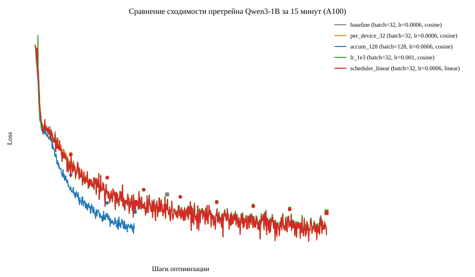
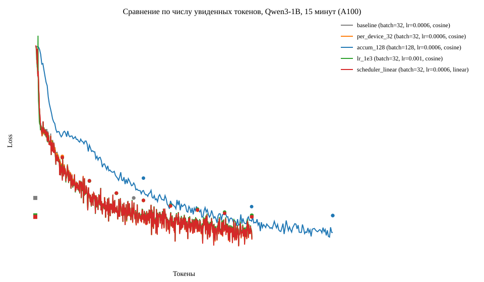
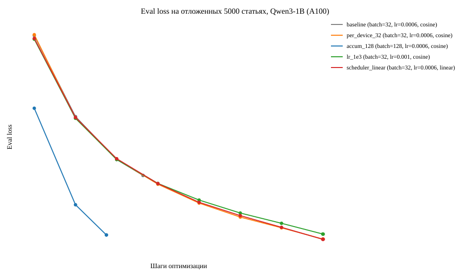

# Претрейн Qwen3-1B на русской Википедии

Модель собрана с нуля и 15 минут училась на A100. Ниже архитектура, данные, пять абляций и то, что успело сойтись.

Графики собраны из `logs/*.log` скриптом `python3 plot_logs.py`. Прогоны `subset` и `smoke` в них не входят. Все пять основных прогонов дошли до таймаута.

## Модель

Каркас из шаблона не менялся: `Qwen3ForCausalLM._from_config`, не предобученные веса.

| | |
|---|---|
| hidden / layers | 2048 / 12 |
| heads / kv heads | 16 / 8 |
| intermediate / head dim | 8192 / 128 |
| активация | silu |
| attention | flash_attention_2 |
| dtype | bf16, tf32 |
| параметров | 960 881 664 |

`pad_token` токенизатора равен `eos_token`. В `labels` паддинг стоит как −100, по `attention_mask`.

## Данные и лимит времени

- Корпус: `wikimedia/wikipedia`, конфиг `20231101.ru`, split `train`, 1 945 063 статьи.
- Токенизатор: `ai-forever/rugpt3small_based_on_gpt2`.
- Блок фиксированной длины 512, truncation и padding.
- Шарды `output_dir/00000.parquet` … `00031.parquet`, порядок файлов сохраняет порядок статей.
- Отложенный сет — первые 5000 статей. Train — остальные 1 940 063.
- Остановка — `TimeoutCallback` на 15 минутах: на шаге, где время вышло, обучение прекращается, затем идут финальные eval и save.

На загрузке шарды читаются через `load_dataset("parquet")` и остаются memory-map'ом Arrow-кэша.

Общие настройки всех прогонов: AdamW fused, weight decay 0.01, warmup 50 шагов, eval каждые 100 шагов оптимизатора, `torch_compile` выключен, gradient checkpointing выключен. Compile съел бы заметную часть 15 минут, поэтому оптимизатор, dtype и compile держались одинаковыми.

Одна эпоха baseline — 60 627 шагов. За 15 минут проходит около 1% эпохи, поэтому косинус и linear на этом горизонте почти не расходятся.

## Абляции

В каждом конфиге сдвинут один фактор относительно baseline.

| прогон | микробатч | accum | эффективный батч | lr | scheduler |
|---|---:|---:|---:|---:|---|
| baseline | 16 | 2 | 32 | 6e-4 | cosine |
| per_device_32 | 32 | 1 | 32 | 6e-4 | cosine |
| accum_128 | 16 | 8 | 128 | 6e-4 | cosine |
| lr_1e3 | 16 | 2 | 32 | 1e-3 | cosine |
| scheduler_linear | 16 | 2 | 32 | 6e-4 | linear |

`per_device_32` меняет только размер микробатча: эффективный батч тот же, 32. `accum_128` меняет только накопление.

## Результаты

Токены = шаги оптимизатора × эффективный батч × 512. В это число входят и паддинг-позиции. Доля eval — время валидаций внутри 15-минутного цикла, без финального прогона.

| прогон | шаги | токены | train loss | eval loss | perplexity | train / eval |
|---|---:|---:|---:|---:|---:|---|
| baseline | 364 | 6.0 млн | 5.18 | 5.637 | 281 | 593 с / 400 с (40%) |
| per_device_32 | 801 | 13.1 млн | 4.11 | 4.944 | 140 | 561 с / 404 с (42%) |
| accum_128 | 275 | **18.0 млн** | 4.36 | 4.989 | 147 | 782 с / 162 с (17%) |
| lr_1e3 | 801 | 13.1 млн | 4.17 | 4.998 | 148 | 583 с / 404 с (41%) |
| scheduler_linear | 801 | 13.1 млн | 4.11 | **4.942** | **140** | 583 с / 404 с (41%) |

`scheduler_linear` и `per_device_32` сошлись: 4.942 и 4.944 на одних и тех же 13.1 млн токенов. `lr_1e3` на тех же 801 шаге чуть хуже, 4.998. `accum_128` увидел больше всех токенов, 18.0 млн, и остановился на 4.989.

На шагах 100 и 200 кривые с эффективным батчем 32 ещё лежат рядом. К шагу 800 `lr=1e-3` отстаёт от `6e-4`.

| шаг | baseline | per_device_32 | lr_1e3 | scheduler_linear | accum_128 |
|---:|---:|---:|---:|---:|---:|
| 100, train | 6.41 | 6.38 | 6.32 | 6.27 | 5.91 |
| 100, eval | 7.16 | 7.17 | 7.12 | 7.13 | 6.37 |
| 200, train | 5.74 | 5.73 | 5.70 | 5.72 | 4.78 |
| 200, eval | 6.28 | 6.26 | 6.26 | 6.27 | 5.32 |
| 800, train | — | 4.35 | 4.43 | 4.37 | — |
| 800, eval | — | 4.945 | 4.999 | 4.942 | — |

Linear и cosine к шагу 800 почти совпали: пройдено 801/60 627 шага эпохи, около 1.3%, и после warmup обе скорости обучения всё ещё около 6e-4. `accum_128` на том же номере шага ниже остальных, потому что шаг несёт 128×512 токенов, а не 32×512.

Eval каждые 100 шагов на 5000 статей занимает около 40 секунд. У прогонов с батчем 32 это около 41% цикла. У `accum_128` шаги тяжелее, валидаций меньше, на eval уходит 17%, и почти всё время идёт в обновления — отсюда 18 млн токенов.

`lr_1e3` и `scheduler_linear` остановились по таймауту на 943 с, код выхода 0. Веса после генерации удалены: в `output_dir/<прогон>/` остался только `trainer_state.json`. В `artifacts/` лежат loss, метрики и тексты.

## Графики

Линии — train loss. Кружки — eval раз в 100 шагов. Квадрат — финальный eval лучшего чекпоинта.







Отдельные кривые законченных прогонов:

- [baseline](artifacts/baseline/loss.svg)
- [per_device_32](artifacts/per_device_32/loss.svg)
- [accum_128](artifacts/accum_128/loss.svg)
- [lr_1e3](artifacts/lr_1e3/loss.svg)
- [scheduler_linear](artifacts/scheduler_linear/loss.svg)

## Генерации

Промпты: «Тильзитский мир - », «Деревня Сно - », «14 восьмитысячников - », «Евразийство становится - ». Сэмплирование: temperature 0.8, top-p 0.95, 128 новых токенов, одна выборка на промпт. `baseline_subset` — проверочный срез в 1000 статей. Пять основных прогонов — финал 15-минутного прогона.

**baseline_subset** — 0.5 млн токенов, 32 шага, eval loss 8.00

Четыре продолжения почти целиком из перевода строки: 14–46 непробельных символов на ~150 символов текста. Видимые куски, пустые строки убраны:

- «Тильзитский мир»: `на. С. — … При в … См. … При`
- «Деревня Сно»: `« —— в. … Приные … При`
- «14 восьмитысячников»: `,, (, и и, к. В в (ные на и на. … См. … Лит`
- «Евразийство становится»: `« … В … При … См … Лит`

Полный вывод — `artifacts/baseline_subset/generations.txt`.

**baseline** — 6.0 млн токенов, 364 шага, eval loss 5.64

```text
PROMPT: Тильзитский мир - 
COMPLETION:  — бывший философскую партию.

Расписание 
В феврале 2006 года был снят:

Гидогор, Дмитрий Кашка.

Описание 
В честь 
В 2007 году, в том числе в России и в Москве.

В феврале 2023 года полковник В. И. И. И., С. А. П., В. М. Б., М. В. С. Богдаков : Изд-во АН СССР, 1994.

В апреле 1943 года — на основе ОАО «Омие»,

С

PROMPT: Деревня Сно - 
COMPLETION:  «Босгашк» () — село в Квареве
  — название «Ува» (Бонак)
  — «Рай» (Киновград) — название «Болодк»
  — «Сит-Вон» — «Мая»
  — «Сверные в России»
  — «Эра» — В. А. Лозеро, Ж. В. Чолов, «Космос».

См. также 

 М. «А. А. К. Похта», «Ан

PROMPT: 14 восьмитысячников - 
COMPLETION: ,,,  —  или  астероидные,,,,,  и —,,,  —,,  —  —,,,  —  —,,  — 

PROMPT: Евразийство становится - 
COMPLETION:  «Лег и» — «Така» — с целью, «Атлантый» и «Овный бун» (, «Пьск».

Примечания

Ссылки 
 

Участники Белинско-Сан-Мюртипе.
Имеш А. П. А., Ж., Д. А. К., М., 1964. — М., 2009. — Т., 2007. — С. 171.
 

А. И., А. Н. История
 А. В. Л., 2008.

```

Дальше у «14 восьмитысячников» до конца 128 токенов идут пробелы и переводы строк.


**per_device_32** — 13.1 млн токенов, 801 шаг, eval loss 4.94

```text
PROMPT: Тильзитский мир - 
COMPLETION:  и.  —  город в  входит в .

Входит в состав  порядка  и  —  порядка.

Население

Примечания

Ссылки 
 Creunt Natuplag.com
 Cretto
 Noton Mango and Wieset (Redo Verschnum)
 Detano Püru, Strumigen mysigenys, Belpolica, Strumysigenys.  

Млекопитающие области
Платки из лука
Озёра Каменского воеводства


PROMPT: Деревня Сно - 
COMPLETION:  населённая административная единица в составе Удмуртской Республики Беларусь.

Административное устройство 
В состав муниципального образования расположена на территории Заволжской области, на правом берегу реки Ика, в 3 км от райцентра «Деревня Ибашанка».

В 1-ом месте у деревни находится  Пла-Сёные озёра.

Вблизи деревни находится  Таз.

Вблизи деревни находится  (празднённая) на юго-западе,  и  на северо-востоке.

Площадь 
Расположено в 12 км на юго-юго-запад

PROMPT: 14 восьмитысячников - 
COMPLETION:  и  –  и  —. 
  (  —  :  и  —??)  -  :  : .  :  :  :  —  :  :  :  :  :  : :  :  ;  : :  :  : ; ;  :  :  : :  :  : 2  :  :,  : [От. и.], А. А. Гольшый в]. :  : Военигород, 2000. - 25 л. (В 2),  :  ;  :  : 

PROMPT: Евразийство становится - 
COMPLETION:  «Batthos bomys».

Описание 

Селенологическая, длиной 12,7 мм. Листья с плоскими, тонкий, застроенный, на севере, в которых, на северо-восток, с заболоченными оболочками. Заполчало.

Хозяйственное значение и листья 
На протяжении многих десятилетий (проектировано в 2012 году) был открыт вид.

В Южной Америке 
В горах находится в юго-западной части, в зоне от центра и на расстоянии приблизительно 25 км на юго-юго-юго-западу от города, на расстоянии

```

**accum_128** — 18.0 млн токенов, 275 шагов, eval loss 4.99

```text
PROMPT: Тильзитский мир - 
COMPLETION:  — фамилия. Известные носители:


 Сальва, Николай Григорьевич (1884—1948) — советский писатель и химик.
 Гет, Александр Петрович (1917—1907) — советский партийный художник.

Известные носители
 Гулеев, Николай Васильевич (1907—1937) — советский архитектор, академик АН СССР (1975).
 Гров, Николай Фёдорович (1923—1971) — Герой Социалистического Труда, Герой Социалистического Труда.
 Куш, Александр Иосифович (1968—1981) — советский

PROMPT: Деревня Сно - 
COMPLETION:  —  деревня в Сергиево-Посадском районе Витебской области России. Входит в состав Пореченского сельского поселения. Население — 15 жителей (2007 год). 
  в западной части Татарстана  в 33 км к востоку от Нижнего Новгорода — 14 км юго-восточнее границы города Великих железной дороги — Витебск — Мичуво.

География 
Деревня расположена на берегу реки Тесичи на расстоянии примерно 3 км на запад.

История 
В годы Великой Отечественной войны деревня была оккупирована гитлеровскими войсками в июле 1941 года, освобождена в октябре 1941 года.

Население

PROMPT: 14 восьмитысячников - 
COMPLETION:  в 2023 году.

В составе экипажа (с 1 февраля 2022 года по 13 сентября 2023 года).

С 2022 года в ходе полёта приняло с поста на самолётах в Санкт-Петербурге, и в августе 2022 года стало известно, что в апреле 2022 года был переведен от должности губернатора Ростовской области.

В июле 2022 года по 1 июля 2022 года был назначен заместителем заместителя начальника управления и подготовки и в результате ремонта до 1 июля 2023 года, в ходе которого было прекращено с 1 января 2023 года по 23 июля 2023 года. В начале сентября 2022 года стал членом парламент

PROMPT: Евразийство становится - 
COMPLETION:  «от  и ».

Изучная деятельность 
Шорская семья, назван в детстве с 1814 года.

С 1784 года 
В 1786 году, по сути, в 1825 году, была замужем за и сын, а также актрисой и сын.

Семья 
Памон — итальянский политик, отец

В 1784 году стал одним из главных ролей во дворец в 1774 году, в 1824 году подпоручиком-земляющим. В 1781 году он был произведён на польском факультете Иоганнского университета.

В 1703

```

**lr_1e3** — 13.1 млн токенов, 801 шаг, eval loss 4.998

```text
PROMPT: Тильзитский мир - 
COMPLETION:  —  и.

Окончила  на  —,  —  и.

Пример  и  —  — �  —  и.

Количество 
В 2008 году, «Лил» () включал в себя два синципы:
,  «Лилль» (), «Харьковский — «Мелёный», «Бр-пут», «Билль» — «Кыв», «Малая Кия: «Шор-Сынка», «Сме-с.

PROMPT: Деревня Сно - 
COMPLETION:  геральды в России. На момент закрытия станции к станции было начато в 2012 году, когда в составе участка линии, в котором в 2002 году была открыта станция на территории, припасного комплекса «Ударки».

История 
Достопримечательности 
В 2008 году на территории города Кадагского района был открыт список в 2013 году. В 2012 году здесь был построен новый магазин.

В настоящее время, в 2015 году в составе участка  на улицу в центре площади.

В 2009 году в эксплуатацию "Сельгия" находится "Ф.

До 2022 года "Белас

PROMPT: 14 восьмитысячников - 
COMPLETION: � ңе, ჴ (см. и. 
  —,  и ე��줵� �� 섅ꭠ삸�����곸�ָ��� 쉡ա� � 쀝ယ�฀��րր� Ғ ��� 숈�ς: ᴵճ긵ḵ��ุ

PROMPT: Евразийство становится - 
COMPLETION:  «Hysiethys dys».

Описание 

Съедние травянистые растения покрыты чёрными листьями, прямостоячие или: и у плёнки и, с водой, на ножке, прицветники, с листочки, на которых. Прицветники и с водой, прицветники и в листья покрыты прямостоятыми оболочками. Цветка из этого вида, то есть как.

Распространение и место обитания 

В природе цветки: в Крыму, Южной Америке, Новой Гвинее, на юго-востоке, на которых расположены в Средиземных и на востоке Индии

```

**scheduler_linear** — 13.1 млн токенов, 801 шаг, eval loss 4.942

```text
PROMPT: Тильзитский мир - 
COMPLETION:  —  топоним:

 Учёт — деревня в Рудийском районе Тверской области.
 Фудоже — деревня в Твериском районе Омской области.
 Тун — посёлок в Верхне-2ском районе Воронежской области.
 Тазинский — посёлок в Сусаловском районе Витебской области.
 Касимов — деревня в составе Заозерского сельсовета.
 Браслав — деревня в Заборском районе Тверской области.
 Кыбаков — деревня в Некрасовском районе Московской области.
 Тавкин — деревня в Бузинском районе Смоленской области.
 Касимов — деревня

PROMPT: Деревня Сно - 
COMPLETION:  район — муниципальное образование в составе Новоудорожского сельского поселения в составе Новоукраинского муниципального района Удмуртской Республики Беларусь.

Административное устройство 
В рамках административно-территориального устройства относится к Новоусаровский сельский округ.

География 
Деревня расположена на правом берегу реки Ик, в 4 км от автодороги, на расстоянии примерно 7 километров (по прямой) к северу от города города Кызы, административного центра района.

Климат 
Климат характеризуется как умеренно континентальный, с умеренно холодной снежной зимой и тёплым летом. Среднегод

PROMPT: 14 восьмитысячников - 
COMPLETION: , в то время как  —.

В то время на то, после чего он был утвержден в распоряжении, как его был похоронен на кладбище в Берлине.

В 1867 году он был рукоположён в сан; его не было его, что она была в ней он был переведён в Москву. В 1933 году был одним из основателей Ассоциации, а в 1919 году, в ходе его был удостоен почетного звания, с 1911 года — в звании ординарного профессора, в 1925 году — в звании генерал-майора, в 1920 году — в Вашингтоне. В 1980 году был переведён на должность помощника инспектора Академии художествознания

PROMPT: Евразийство становится - 
COMPLETION:  «B».

В 1994 году, когда в 1979 году, когда она получила название, а в 1970 году она была открыта под названием Hoan. В 2014 году она была открыта станция, а затем, в 2007 году была открыта станция метро для проведения компании.

В 2004 году компания выпустила статус:

В 2004 году компания выпустила новый офис компании Mydronow.

В 2015 году, в 2004 году было принято решение обелиск.

В 2007 году на WTA была выпущена для Java-Stud в 2003 году.

В 2013 году компания была разработана новый статус компании на продажу M

```

У `baseline_subset` все четыре промпта — переводы строк и заготовки разделов («В», «См.», «При», «Лит»). У baseline на тех же промптах уже есть фразы, даты и имена; «14 восьмитысячников» по-прежнему запятые и пустые строки.

У `per_device_32` «Деревня Сно» держит форму статьи о населённом пункте: административная единица, река, километры, раздел «Площадь». «Тильзитский мир» в том же прогоне смешивает шаблон города, латинские строки и «Млекопитающие области». «14 восьмитысячников» — двоеточия и библиографический хвост. «Евразийство становится» уходит в описание растения.

У `accum_128` «Тильзитский мир» — страница «фамилия / известные носители» со списком «имя (годы) — занятие», в том числе «1917—1907». «Деревня Сно» — абзац с районом, поселением и населением, затем «География» и «История» с оккупацией 1941 года; в одном тексте Сергиево-Посадский район, Витебская область, Татарстан и Нижний Новгород. «14 восьмитысячников» и «Евразийство становится» — связные предложения про назначения 2022–2023 годов и биографию XVIII–XIX веков.

Длинные связные куски появляются у прогонов с большим числом токенов. У `accum_128` шагов меньше, чем у baseline (275 и 364), тексты при этом заполняют лимит и держат вики-разделы.

У `scheduler_linear` те же 13.1 млн токенов и тот же eval loss, что у `per_device_32`. «Тильзитский мир» — список «название — деревня в районе». «Деревня Сно» — муниципальная статья: устройство, река, километры, климат; в одном абзаце Удмуртия и Беларусь. «14 восьмитысячников» и «Евразийство становится» — связная проза про биографию и компанию.

У `lr_1e3` шагов и токенов столько же, eval loss 4.998. «Тильзитский мир» — обрывки кавычек. «Деревня Сно» — предложения про станцию и магазин. «14 восьмитысячников» — битая строка. «Евразийство становится» — снова описание растения.

При равных 13.1 млн токенов linear и cosine с lr 6e-4 дают один и тот же тип заготовки. lr 1e-3 на этих четырёх выборках рвётся чаще. Факты во всех законченных прогонах выдуманы.

## Вывод

За 15 минут решает число обновлений и токенов. `scheduler_linear` и `per_device_32` сошлись к eval loss 4.94 при 13.1 млн токенов. `lr=1e-3` на той же длине дал 4.998. Накопление до 128 подняло число токенов до 18 млн, шагов при этом 275, eval loss 4.99. Linear и cosine за 1.3% эпохи не разошлись.
